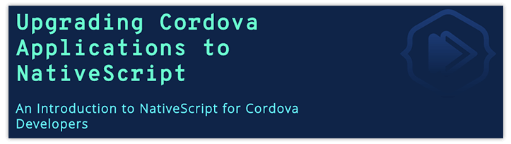

# The Road from Hybrid Back to Native is a Sweet One

Before 2013, mobile apps that needed to be performant and have a native feel stood no chance unless they were created with native technologies. Back then, web developers, those that knew HTML and JavaScript, hung out at different coffee shops and shopped at different clothing stores than native developers. **Web devs desperately wanted to fit in and create mobile apps too**, like the cool native devs, but they didn’t want to learn xCode, Eclipse, Objective-C, or Java.

## Early Days of Cordova/PhoneGap

[Apache Cordova](https://cordova.apache.org/) has been around for many years before 2013, and it’s been instrumental in allowing web developers a peak into what it’s like to create for mobile using a hybrid approach, a peak into the cool life of mobile. And JavaScript developers everywhere rejoiced because they could not have a sip of that super special latte that THEIR coffee shop didn’t carry. The excitement was short lived though.

Even though web devs could now create mobile apps that lived in App Stores, because hybrid apps live in a [WebView](https://developer.telerik.com/featured/what-is-a-webview/) and are really just web apps wrapped in a native shell, there was nothing to hold these devs back from creating monstrosities that would make any native developer cross to the other side of the street and avoid eye contact.

> Most hybrid apps of the pre-2013 era were clunky, shaky, and due to their lack of native feel, harder to use than their native counterparts. 

## Renaissance of Ionic

After 2013, when [Ionic framework](https://ionicframework.com/) came about, it unified the hybrid development approach. Thanks to Ionic, which is built on top of Apache Cordova, hybrid mobile app development has evolved and matured to a point where some hybrid apps cannot be differentiated from their native equivalents. Ionic kept us crazy web developers in check and limited our imaginative whims in order to preserve consistency in the look and feel, to better match the native environment and increase perceived performance. This was like bowling with bumpers and success was at hand!

*Fast forward to 2018.* iOS and Android are the two winners of the mobile world and they are constantly competing to be one or two steps ahead for better usability, higher performance, faster animations, more form factors (although this last one is a questionable goal as far as I’m concerned). While native developers just have to deal with adding a new API to their existing tool belt, hybrid developers are being left behind. Cordova and Ionic cannot keep the pace of constant underlying native framework changes and support all the new native user experiences and paradigms that have evolved. While Ionic developers felt like they were cool enough to fit in with the native devs for the last few years, this feeling is starting to slip away now as it becomes harder and harder to use the newest SDKs and APIs. 

## Enter NativeScript and JavaScript-Native

**This is where newer frameworks like NativeScript were born and are gaining huge popularity.** Why? Because NativeScript doesn’t have layers upon layers of abstraction between the native world and your code. You can actually write JavaScript code that talks directly to the native APIs. The framework itself was designed from the ground up to allow access to all Native SKDs and APIs, so not only are the framework UI components written using this technique, but those same developers that used to be web developers can now BE native developers, yet still write their code in JavaScript. Yes, they can sit in the same coffee shop and buy the same cool clothes as native developers because they ARE native developers, just armed with JavaScript. 

So what would a Cordova developer do if they don’t want to be left behind, if they want to have all the access to native APIs, but still use their skills like JavaScript, TypeScript, and CSS? What would a Cordova developer do to further their career and keep up to date with the latest native trends? How about starting with a free introduction course on how your Cordova skills can be immediately and quickly applied to create fully native apps using NativeScript?

## Upgrade Cordova to Native

This course, [Upgrading Cordova Applications to NativeScript](https://nativescripting.com/course/upgrading-cordova-applications-to-nativescript/), is free and is out now on NativeScripting.com. Cordova and NativeScript plugins master, Eddy Verbruggen, and I have teamed up to bring you this course. In this course, we show you how to convert different parts of a Cordova application to the NativeScript equivalent. It’s easier than you might think and the result is sweet. You end up with a truly native app that you’ve build using your existing skills like JavaScript and CSS. Some code even transfers without modification.

[NativeScripting](https://nativescripting.com) is a video course library that has been around for just about a year. Thousands of web developers, Angular developers, and Cordova and Ionic developers have signed up to take online video courses there. Powerhouse real-world developers like Paul Halliday, Nathan Walker, Sean Perkins, as well as Eddy Verbruggen have all contributed courses to NativeScripting and are waiting to teach you beginner to advanced topics in NativeScript. 

To conclude, while there will certainly be a need to maintain old Cordova applications in the years to come, the mobile world is not waiting around. New native UI techniques are quickly surpassing the limitations of hybrid. Keep yourself up to date and you can hang out at the cool coffee shop.

[Upgrade to NativeScript](https://nativescripting.com/course/upgrading-cordova-applications-to-nativescript/)
