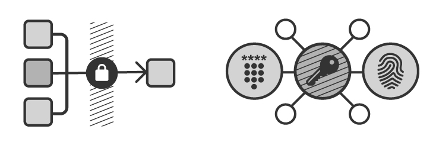
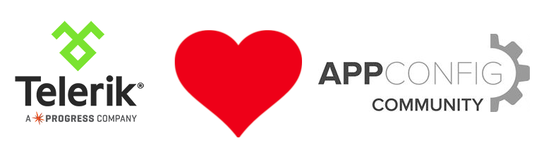

## The Telerik and AppConfig Partnership

A few weeks ago at [Mobile World Congress](https://www.mobileworldcongress.com/), the formation of the [AppConfig Community](http://www.appconfig.org/) was announced. The primary goal of this new community is to create a single, open approach for enterprise iOS mobile app configuration and security by leveraging the best of native standards. Among other powerhouses like [AirWatch](http://www.air-watch.com/), [IBM](http://www.ibm.com/us-en/), and [MobileIron](https://www.mobileiron.com/), Telerik is proud to partner in this endeavor.

### Why AppConfig?

Security is paramount when it comes to mobile computing. Historically, developers have had to use proprietary SDKs from vendors like AirWatch, MobileIron, Citrix, and others to enable configuration and security features of their apps (commonly recognized as MAM - or Mobile Application Management). In some cases this required developers to create separate versions of their apps for each vendor or at least re-learn common practices when switching from one proprietary SDK to another. By leveraging AppConfig and its open standards, time to market is decreased by making security/configuration management far simpler than what was previously required.

### What is AppConfig?

From the developer perspective, AppConfig will provide a truly open means of leveraging security and configuration features on mobile devices. The AppConfig Community announced an open XML schema for enterprise app configurations - which streamlines app deployment by making it easy for developers to define configurations and for businesses to deploy them.

When you build an iOS app with native frameworks and this new AppConfig XML schema, your app will work consistently across participating EMM/MAM vendors. The AppConfig Community will also work to provide best practices for enterprise developers based on native features like SSO, VPN, security policies, and access controls.

### What is Telerik's Role?

Telerik is [proud to be part](http://www.appconfig.org/partners/) of the AppConfig Community, especially in these early days. Our role will increase dramatically this year, as we work to provide integrations with both the [Cordova](https://cordova.apache.org/) and [NativeScript](https://www.nativescript.org/) frameworks - making developing, securing, and managing an app created with the [Telerik Platform](http://www.telerik.com/platform) easier than ever.

**Keep an eye on the Telerik blogs for more exciting announcements in the months ahead!**

### Looking Forward

As 2016 progresses, members of the AppConfig Community will create the tools needed to enable developers simplify development and deployment of secure mobile apps. We at Telerik look forward to participating in this endeavor!