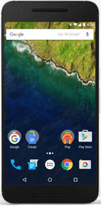
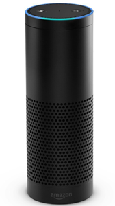
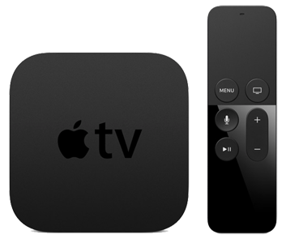

## Prize Winners and Recap of Telerik Platform NativeScript Webinar

During the most recent webinar, the [Telerik Platform](http://www.telerik.com/platform) team provided some in-depth information and demos on how to leverage [NativeScript](https://www.nativescript.org/) to develop native mobile apps. If you were unable to watch the webinar live, you can watch it now on YouTube:

 <iframe width="560" height="315" src="https://www.youtube.com/embed/8OEiT6iEvMw" frameborder="0" allowfullscreen></iframe> 

For those of you who were able to attend, you'll know that we had not one, but two huge prize raffles! The first was a raffle for webinar attendees and the second was for webinar registrants who set up a [free 30-day Telerik Platform trial](https://platform.telerik.com/#register) and simply created a build of an iOS or Android app.

Before we get to the winners, let's take a quick look at the enhancements we delivered in this release:

- Improvements to developing native apps with [NativeScript](https://www.nativescript.org/)
- Brand new set of [Telerik Platform Companion Apps](http://www.telerik.com/platform/appbuilder/companion-app)
- New release of the Universal Desktop Client for [Mac](https://platform.telerik.com/appbuilder/downloads/proton/osx) and [Windows](https://platform.telerik.com/appbuilder/downloads/proton/win)

> For a more comprehensive overview of this Telerik Platform release, please consult [our release blog post](http://www.telerik.com/blogs/bringing-true-native-app-development-to-telerik-platform)

### Top Questions and Answers

We received A LOT of great questions from webinar attendees. What follows is a shorter list of what we think are some of the most critical questions:

**Q:** Can you elaborate on differences between Hybrid vs Native?

**A:** Hybrid technologies run a mobile app from within a [web view](http://developer.telerik.com/featured/what-is-a-webview/) and relies more on web technologies (HTML, JavaScript, CSS). A native app uses each platform's technology (iOS or Android) - and does not run within a web view, providing better performance. Our NativeScript framework produces truly native apps using JavaScript, CSS, and XML for markup.

---

**Q:** What are your plans moving forward to support new NativeScript releases in Telerik Platform?

**A:** We plan to have quick releases with experimental support for NativeScript 2.0 shortly after it is released and full support by the start of June.

---

**Q:** Did you just build and deploy an iOS app without using a Mac?

**A:** Yes! [Telerik AppBuilder](http://www.telerik.com/platform/appbuilder) builds your apps for iOS in the cloud so that you don't need to have a Mac or Xcode.

---

**Q:** I am planning to develop an app which uses device features like gyroscope, accelerometer, etc. Does Telerik Platform support using these features on the device?

**A:** This depends on the approach you're looking to employ - hybrid or NativeScript. For hybrid apps, these features are already available - you can access most of the device capabilities using the Cordova core plugins (camera, accelerometer, compass, etc.) and additional device and service functionality using custom or [verified Cordova plugins](http://plugins.telerik.com/cordova) (like Apple Watch support). For NativeScript apps, the framework already provides access to device capabilities like camera and geolocation. Other sensors might need to be accessed with native code.

---

**Q:** Will NativeScript be updated to work with Windows Phones?

**A:** Yes! In fact we already released a [preview of our Windows Universal runtime](https://www.nativescript.org/blog/nativescript-runtime-preview-for-windows-10). We hear the feedback loud and clear and are actively looking at how to prioritize Windows Universal support!

---

**Q:** Recently when i was working on my hybrid app I noticed that the UI in the simulator vs the actual device looked really different? Can you advise me if there is anything to be done to avoid these scenarios?

**A:** It depends on exactly what you’re testing. But we recommend starting out by using the simulator, moving on to any [local emulators](http://docs.telerik.com/platform/appbuilder/cordova/running-in-emulators/native-emulators) you have, and then moving quickly to [debugging on actual devices](http://docs.telerik.com/platform/appbuilder/cordova/debugging-your-code/debugging-on-device/debugging-on-device) to avoid any UI surprises

---

**Q:** Do we have a time frame for Angular 2 integration?

**A:** NativeScript supports Angular 2 today! Try out our [new Angular 2 getting started guide](http://nativescript.github.io/nativescript-angular-guide/).

### Prize Winners

The part you've all been waiting for! Here are the list of prizes and the winners (don't worry, we will be reaching out to all prize winners individually):

<table>
<tr>
<td align="center"> Lego Mindstorms <b>Anita K.</b></td>
<td align="center"> iPad Pro <b>Stephen M.</b></td>
<td align="center"> iPhone 6S <b>Shane M.</b></td>
</tr>
<tr>
<td align="center"> Nexus 6P <b>John S.</b></td>
<td align="center"> Amazon Echo <b>Robert P.</b></td>
<td align="center"> Apple TV <b>Dusty R.</b></td>
</tr>
</table>

**Thanks to everyone who joined the webinar and don't forget to try your own [FREE 30 day trial](https://platform.telerik.com/#register) of the Telerik Platform today!**