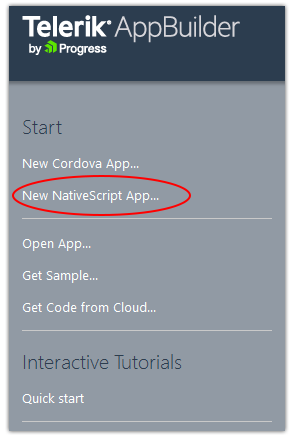
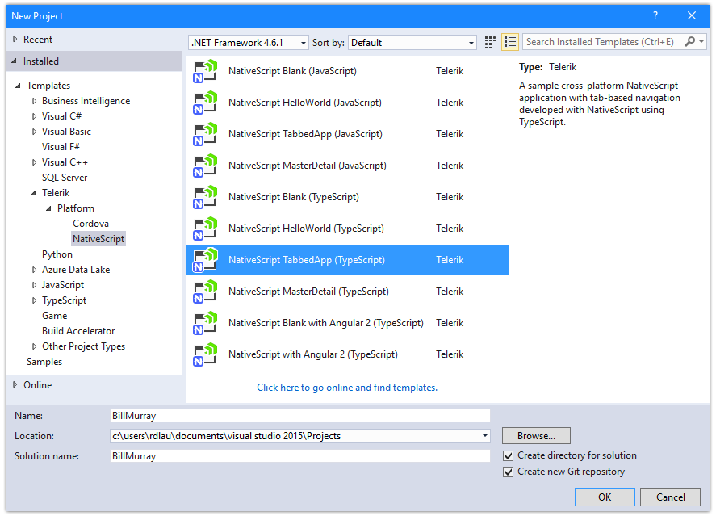
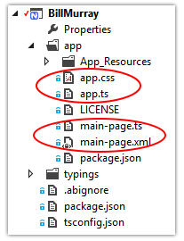
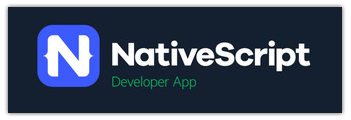
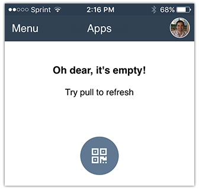
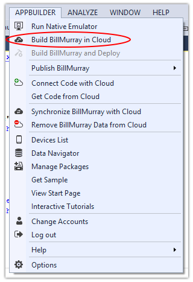
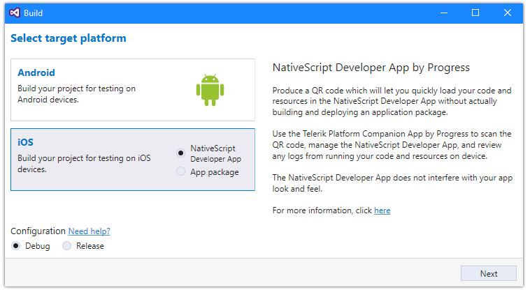
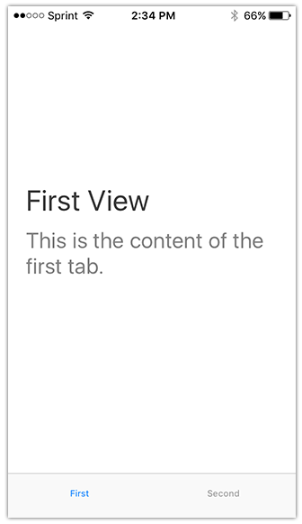
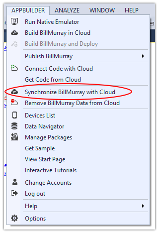
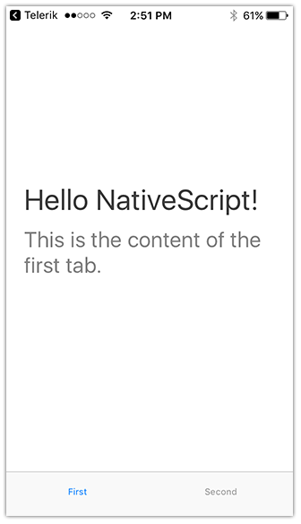

# Creating Your First Native Mobile App with Visual Studio

Visual Studio is arguably the most adored IDE of all time. For years .NET developers relied on a myriad of robust features and integrations in Visual Studio to make them more productive creating desktop and web applications. Then came mobile.

While a handful of developers leveraged Visual Studio to create Windows Phone 7/8 apps, the vast majority of mobility development was focused on iOS and Android. .NET developers were summarily left out in the cold. That is until Xamarin and Cordova came about.

Cordova presented the opportunity for web developers from all corners the ability to create hybrid mobile apps for virtually every platform. And Telerik Platform was one of the first mobile app development platforms to embrace the hybrid model (and now native). But hybrid apps tend to have their own issues with performance that truly native apps don't suffer from.

With Xamarin, .NET developers can leverage their existing knowledge of C# to build cross-compiled native apps for iOS, Android, and Windows. Combining the cross-platform capabilities of Xamarin.Forms with [Telerik UI for Xamarin](http://www.telerik.com/xamarin-ui), C# developers are now empowered to build native apps while sharing a fair amount of code. While Xamarin is a big win for C# developers, Visual Studio has always been about more than just C#.

## NativeScript

If you enjoy what TypeScript has to offer, are doing client-side development with Angular, or just like the power and flexibility of vanilla JavaScript, but also want to keep leveraging your favorite IDE, NativeScript may be just the thing for you.

> You may want to take a moment to read [NativeScript for the .NET Developer](http://developer.telerik.com/featured/nativescript-for-the-net-developer/) for more background.

NativeScript is an open source framework (with enterprise support) that allows you to build truly native, cross-platform, mobile apps using the skills you know and love:

- **XAML-like XML** for your UI markup
- **CSS** for styling your UI
- and **JavaScript/TypeScript** for your app logic

NativeScript also allows for nearly 100% code sharing across platforms as well, dramatically decreasing development time and getting you to market faster than ever before.

Add Telerik AppBuilder (part of Telerik Platform) to the mix, and you can also build your apps for iOS without owning a Mac and dealing with Xcode.

So let's build an app!

## Your First Native Mobile App

Together in this series we are going to cover literally every part of building a fully functional cross-platform app using a combination of Visual Studio, NativeScript, TypeScript, and AppBuilder. Our supporting backend will be created with C# and SQL Server.

The app we are going to build is...wait for it...a Bill Murray quote app! Who doesn't love Bill? Our app will feature the following capabilities that are common in app development:

- Tab-based navigation
- Remote data access
- CSS/themes
- Fonts
- Images

And just so we know what the end result will look like, here is a quick example of our soon-to-be-created app on iOS:

GIF IMAGE

## Initial Setup

Let's make sure our environment is set up for us. We will need to:

1. If you don't have it already, download and install [Visual Studio](https://www.visualstudio.com/downloads/). Yes, the free Visual Studio Community edition works just fine!
2. [Start a free 30 day trial](https://platform.telerik.com/#register) of Telerik Platform (which includes AppBuilder).
3. Download and install the [AppBuilder extension for Visual Studio](http://cdn.icenium.com/live/vs/AppBuilder.vsix).

With these brief installations done (well, brief if you didn't have to install Visual Studio!) you are all set. There are no other dependencies you have to install to build an app for iOS and Android!

## Initialize an App

Open Visual Studio and log in to your newly created Telerik Platform acccount. On the screen provided, you'll see that you have numerous options to create a new hybrid app with Cordova, a new native app with NativeScript, or even get sample code, view documentation, or take a spin through our quick start tutorial. All good things to do, however, today let's go directly to creating a new NativeScript app:

You'll next see that there are a lot of templates to choose from when starting an app. Whether you want to use plain JavaScript, TypeScript, or Angular templates, you have plenty of options. Since we are building a tabbed interface with TypeScript, let's start with the TypeScript TabbedApp:

Before we start building our app, let's take a quick look at the assets that are part of this template:

I'm highlighting two important groups of assets, the `app` and `main-page` files. In NativeScript, `app.js` is the first file executed and effectively bootstraps your app. In our `app.ts` file you'll see some pretty straightforward code:

	import application = require("application");
	application.cssFile = "./app.css"
	application.start({ moduleName: "main-page" });

First we are requiring the `application` modules (essential for NativeScript to work). We are setting a CSS file *for the entire app*. And finally we are specifying the first module, or view, that we should start with. In this case, it's `main-page`.

Before we look at our `main-page` assets, let's look at the `app.css` file:

	.tab-content {
	    vertical-align: center;
	    color: #808080;
	    font-size: 24;
	    padding: 20;
	}
	
	.title {
	    margin: 0 0 10 0;
	    font-size: 32;
	    color: #3c3c3c;
	}

The first thing you might notice is that NativeScript uses the same class selectors (id and element as well) as the CSS you use on the web. You'll also notice that there aren't any `pt` or `px` units, because NativeScript uses device-independent units to avoid differences in devices.

Remember that this CSS file applies to all pages, or views, of our entire app. If you want to create a CSS file for an individual page/view, you can do that as well. For instance, if we wanted a custom CSS file for our `main-page` view, we would simply call it `main-page.css`. Easy enough!

> Tip: NativeScript's file syntax makes it easy to use platform-specific assets in your app. For example, `main-page.ios.css` would only be visible on iOS.

Let's next look at what we were given for our `main-page` assets: `main-page.xml` and `main-page.ts`. This `main-page` view is the first (and only) view of our app, so it's the first thing our users will actually see. And this is where our native UI comes in, with the `main-page.xml` file.

NativeScript uses a simple XAML-like syntax for defining native UI elements. For example, to stack two labels on top of each other, we'd do something like this:

	<StackLayout>
		<Label text="Hello" />
		<Label text="World" />
	</StackLayout>

> Tip: Read more about layouts in this article on ["Demystifying NativeScript Layouts"](http://developer.telerik.com/featured/demystifying-nativescript-layouts/)

Now the layout provided in `main-page.xml` is a little more complicated, but not much:

	<Page xmlns="http://schemas.nativescript.org/tns.xsd" loaded="pageLoaded">
	  <TabView>
	    <TabView.items>
	      <TabViewItem title="First">
	        <TabViewItem.view>
	          <StackLayout class="tab-content">
	            <Label text="First View" class="title"/>
	            <Label text="This is the content of the first tab." textWrap="true"/>
	          </StackLayout>
	        </TabViewItem.view>
	      </TabViewItem>
	      <TabViewItem title="Second">
	        <TabViewItem.view>
	          <StackLayout class="tab-content">
	            <Label text="Second View" class="title"/>
	            <Label text="This is the content of the second tab." textWrap="true"/>
	          </StackLayout>
	        </TabViewItem.view>
	      </TabViewItem>
	    </TabView.items>
	  </TabView>
	</Page>

You'll see we have:

- a `Page` element that encompasses all of our UI;
- a `TabView` which is the parent of our two `TabViewItems`;
- each `TabViewItem` contains a view with a `StackLayout` and two `Labels`.

So when we have a view with tabs, we really have two separate views of data on one page. This is great for us, because if you remember when you first saw what the app is going to look like, we had three tabs of data, so we are already well on our way!

Finally, the `main-page.ts` file is effectively the code-behind of our `main-page.xml` view. All of our business logic will be executed here:

	import observable = require("data/observable");
	import pages = require("ui/page");
	
	export function pageLoaded(args: observable.EventData) {
	    var page = <pages.Page>args.object;
	    var emptyContext = new observable.Observable();
	    page.bindingContext = emptyContext;
	}

Mention MVVM!

Here we are simply importing the `observable` and `pages` NativeScript modules. We also have a `pageLoaded` function which, if you look back at `main-page.xml` is a function called when the page is loaded.

> Tip: NativeScript modules are cross-platform abstractions of native code. This allows you to just use JavaScript/TypeScript instead of writing code that looks like Objective-C or Java. Yuck!

## NativeScript Companion Apps

Before we proceed, let's see what this stock template looks like on a real device. The fastest and easiest way to do this is by using the Telerik Platform Companion app + the NativeScript Developer App. Both are available for free:

- Telerik Platform Companion App ([iOS](https://itunes.apple.com/us/app/platform-companion-by-progress/id1083895251?mt=8) and [Android](https://play.google.com/store/apps/details?id=com.telerik.PlatformCompanion&hl=en))
- NativeScript Developer App ([iOS](https://itunes.apple.com/us/app/nativescript-developer-app/id882561588?mt=8) and [Android](https://play.google.com/store/apps/details?id=com.telerik.NativeScript&hl=en))

The Telerik Platform Companion App is where you will discover and open apps up for viewing. The NativeScript Developer App is effectively a native container for your app, making it super easy for the Companion App to deliver an app on your device.

These apps work together by syncing your local Visual Studio project files with the cloud and pushing them to your device. This happens without a lengthy app build, so your app is almost instantly available.

Go ahead and open up the Telerik Platform Companion App. Log in with your Telerik Platform credentials and tap on **MyApps**. You'll probably get a screen that looks like this:

That's fine, because as we stated already, since your project is only on your PC, your Companion App knows nothing about your Visual Studio project. Let's change that.

Back in Visual Studio, use the **APPBUILDER** menu and choose **Build {app name} in Cloud**:

From the menu provided, choose the OS of your device and then make sure you choose "NativeScript Developer App" as your target. We don't want to do a full app build here, we just want to prepare the app for deployment within the Developer App.

Click the **Next** button and you'll be presented with a QR code. Back in the Telerik Platform Companion App, tap on the little QR code button that you saw on your **My Apps** screen. Scan the QR code provided and voila, there is your app!

> Note: If you want to share your Visual Studio project with other AppBuilder clients (like the [web IDE](http://www.telerik.com/platform/appbuilder/in-browser-client)), you can use the **APPBUILDER** menu and choose **Connect Code with Cloud**.

## AppBuilder LiveSync

Before we start writing some code, let's take a quick look at one of the biggest productivity boosters you get from AppBuilder, and that is LiveSync.

LiveSync allows you to see changes in your app as you make them. No waiting for a full rebuild and deployment to your device, LiveSync works behind the scenes to make sure you always have the latest code changes on your device. LiveSync is available in two scenarios:

1. Did you build your app in the cloud and deploy to a connected (real) device? If so, LiveSync works automatically when files are saved, as long as you keep your device tethered to your PC.
2. Did you use the Telerik Platform Companion App to deploy your app? (Yes, that's what we did.) If so, LiveSync syncs your files when you do a three-finger tap within the app.

Let's try it out quickly!

In Visual Studio, open your `main-page.xml` file and change one of the labels. Let's change the "First View" text in one of our labels to "Hello NativeScript!". Your `label` should now look like this:

	<Label text="Hello NativeScript!" class="title"/>

Save the file and go to the **APPBUILDER** menu and choose **Synchronize {app name} with Cloud**. This tells Visual Studio to sync your updated app files with the cloud.

Then back on your device, **tap and hold three fingers** with your app running. You'll get a notification that the the Companion App is downloading and extracting the package. And then:

All without having to do a complete re-build and re-deployment of the app.

## What's Next?

In the next part of this series, we are going to actually write some code! We will build the structure of our app using NativeScript layouts, native UI elements, and mock in some data. After that we are going to dive into creating a simple WebAPI backend and look at how we can style our app with CSS!