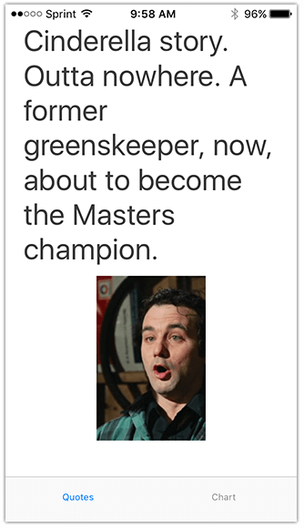
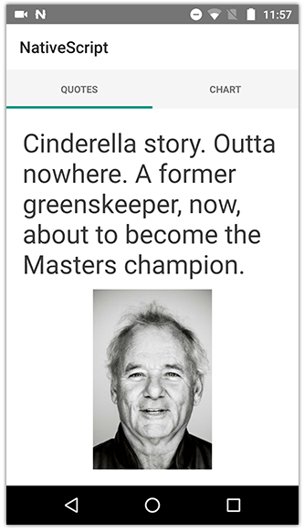
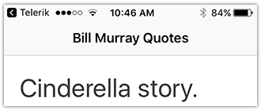
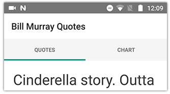
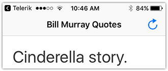
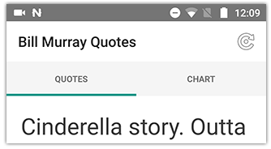
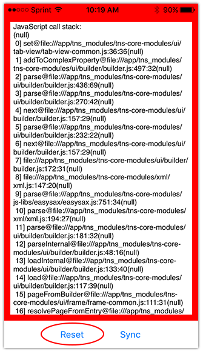

# Creating Your First Native Mobile App with Visual Studio (Part 2)

[**&lt;-- Read Part 1**](#)

In the first post of this series, we started our "Bill Murray" mobile app with [NativeScript's](https://www.nativescript.org/) tab strip TypeScript template in Visual Studio, using [Telerik AppBuilder](http://www.telerik.com/platform/appbuilder). Now it's time to write some code to create a truly native, cross-platform app, with 100% code re-use between our iOS and Android apps. By the end of this article we hope to:

- Learn about NativeScript layouts;
- Build our app structure using native UI elements;
- Mock in some data to show off a fully-functional app.

Let's get started!

## NativeScript Layouts

The XML syntax behind NativeScript layouts will be very familiar to those of you who have used XAML-based layouts in the past. For example:

- XAML has `<Grid>` and NativeScript has `<GridLayout>`
- XAML has `<StackPanel>` and NativeScript has `<StackLayout>`
- XAML has `<DockPanel>` and NativeScript has `<DockLayout>`
- XAML has `<WrapPanel>` and NativeScript has `<WrapLayout>`
- XAML has `<Canvas>` and NativeScript has `<AbsoluteLayout>`

Of course both XAML and NativeScript [have more layout options than just these](https://docs.nativescript.org/ui/layouts#layouts), but you get the idea.

> Tip: Read more about layouts in this article on ["Demystifying NativeScript Layouts"](http://developer.telerik.com/featured/demystifying-nativescript-layouts/)

If you recall from last time, our simple Bill Murray app is going to have one page with a `TabView` containing two views of data. One tab is going to show quotes and images from some of his movies and the second will show a chart breaking down the quotes by movie.

The first view will need the ability to show a random quote (we need a `<Label>` to display a string) and an image of Bill Murray (we need an `<Image>` to display an image). We will want the UI elements stacked on each other, so we will use the `<StackLayout>` layout tag.

Open up `main-page.xml` and replace the current contents with this:

	<Page xmlns="http://schemas.nativescript.org/tns.xsd" loaded="pageLoaded">
	  <TabView>
	    <TabView.items>
	      <TabViewItem title="Quotes">
	        <TabViewItem.view>
	          <StackLayout class="tab-content" id="layout">
	            <Label text="{{ quote }}" class="title" textWrap="true" />
	            <Image src="{{ image }}" />
	          </StackLayout>
	        </TabViewItem.view>
	      </TabViewItem>
	      <TabViewItem title="Chart">
	        <TabViewItem.view>
	          <Label text="Chart Placeholder" class="title" />
	        </TabViewItem.view>
	      </TabViewItem>
	    </TabView.items>
	  </TabView>
	</Page>

> Tip: Tabs can also be [dynamically generated](https://docs.nativescript.org/cookbook/ui/tab-view) at runtime, but for simplicity sake we are going to do as much layout as we can with XML.

Remember, to see your changes at any time you can use the **Build {app name} in Cloud** function to build for the Telerik Platform Companion App. If you've already deployed an app build to the Companion App, you can use the **Synchronize {app name} with Cloud** function and do a **three-finger tap** (iOS) or **tap the "sync" function in the notification menu** (Android) to load your changes.  (Android)

You may be asking yourself, "what are those {{ }} curly braces all about?". This is commonly referred to as "mustache syntax" and is a way for us to implement [data binding](https://docs.nativescript.org/core-concepts/data-binding) in our app. Which makes now a great time to start building out our code behind!

## Code Behind and Mock Data

The brains of our app will be in the `main-page.ts` code behind file (we know it's the code-behind file for `main-page.xml` simply because of the file name syntax). Let's start working on our app's business logic and mock in some sample data so we can get a real-world idea of how our app will function.

Go ahead and replace everything in your `main-page.ts` file with this:

	import observable = require("data/observable");
	import pages = require("ui/page");
	
	export function pageLoaded(args: observable.EventData) {
	
	    let page = <pages.Page>args.object;
	    let myLayout = page.getViewById("layout");
	
	    myLayout.bindingContext = {
	        quote: "Cinderella story. Outta nowhere. A former greenskeeper, now, about to become the Masters champion.",
	        image: "https://www.fillmurray.com/200/302"
	    };
	
	}

You can see we've made some small changes to our `pageLoaded` function, which is called when this view is first loaded (see `loaded="pageLoaded"` in `main-page.xml`). We are also binding static data to our `StackLayout` element (you can see how we get the reference to the `StackLayout` as we select the element by its id with `page.getViewById("layout")`.

> We will be using [fillmurray.com](https://www.fillmurray.com/) to load remote images of Bill!

You'll notice the corresponding `text="{{ quote }}"` and `src="{{ image }}"` properties in our UI elements match up to the `quote` and `image` properties we define when we bind our data.

Once these changes are in place, use the **Synchronize {app name} with Cloud** menu option and do a **three-finger press** (iOS) or **tap the "sync" function** (Android) to load your changes. You should see something like this on both iOS and Android:

 

Yay! We have a very simple, cross-platform native app, running on both iOS and Android platforms with 100% code re-use.

**But we can do better!**

## Additional UI Elements

We will spend some time prettying it up later, but for now, let's make two small UI changes:

- Add an `ActionBar` to display the title;
- Add a reload button to display a new quote/image.

It's very easy to add an `ActionBar` to our app. Between the opening `<Page>` element and the opening `<TabView>` element, paste this:

	<ActionBar title="Bill Murray Quotes" />

This will give you a nice little [ActionBar](http://docs.nativescript.org/ui/action-bar) that looks like this on iOS and Android:

 

Next, let's add a reload button to our `ActionBar`. We will do this by adding an [ActionItem](http://docs.nativescript.org/ui/action-bar#action-items) to our `ActionBar` element:

	<ActionItem tap="onReload" ios.systemIcon="13" ios.position="right" android.systemIcon="ic_menu_rotate" android.position="actionBar" />

In this code snippet you'll notice some iOS- and Android-specific properties. This is the first example of how you can make changes to your app, in code, that are only visible on the appropriate platforms.

> Tip: Take a look at this article on [platform-specific development with NativeScript](http://developer.telerik.com/products/nativescript/platform-specific-development-nativescript/).

**What properties did we add to our `ActionItem` element?**

- An `onReload` function that is fired when the icon is tapped;
- Icons from the `systemIcon` sets on both iOS and Android (see iOS and Android [system icon options](https://docs.nativescript.org/ui/action-bar#setting-icons));
- Positioning the iOS icon to the *right* of the action bar title, and Android positioning *on* the action bar (just some platform-specific quirks!).

Of course, we don't have a corresponding `onReload` function set up yet, but just for the sake of the UI, your code should now look like this in `main-page.xml`:

	<Page xmlns="http://schemas.nativescript.org/tns.xsd" loaded="pageLoaded">
	  <ActionBar title="Bill Murray Quotes">
	    <ActionItem tap="onReload" ios.systemIcon="13" ios.position="right" android.systemIcon="ic_menu_rotate" android.position="actionBar" />
	  </ActionBar>
	  <TabView>
	  ...

Which results in the following updated `ActionBar` UI in iOS and Android:

 

## Handing Errors in the Companion App

It's inevitable. Even using TypeScript, every once in a while we will make a mistake and that mistake might not be visible until we actually deploy the app to our device.

Error handling for NativeScript apps in the Telerik Platform Companion App is not quite perfect. Sometimes you do a LiveSync and your app just straight up crashes! If this is the case, chances are very good that you just introduced an error. The easiest way to discover the error and resolve the problem is to:

1. Kill and re-open the NativeScript Developer App on your device;
2. Discover the error with the console log output provided (see iOS example below);
3. Tap **Reset** to completely reset your NativeScript Developer App and start over with a new build.

> One way to help avoid errors is by [writing unit tests](http://developer.telerik.com/products/nativescript/adding-unit-tests-to-your-nativescript-app/). NativeScript has built-in support for Jasmine, Mocha, and QUnit.

## What's Next?

While our app UI isn't *quite* complete yet, now is a good time for us to move on to work on our backend! In the next article in this series, we will put NativeScript aside and focus on creating a fully functional backend with SQL Server and a RESTful service built with ASP.NET Web API. Once that is done, we will put the finishing touches on our app with some CSS styling, native animations, and a quick look at [Telerik UI for NativeScript](http://www.telerik.com/nativescript-ui)!

[**Read Part 3 --&gt;**](#)