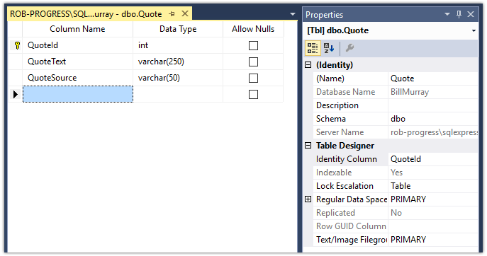
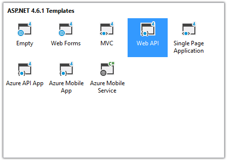
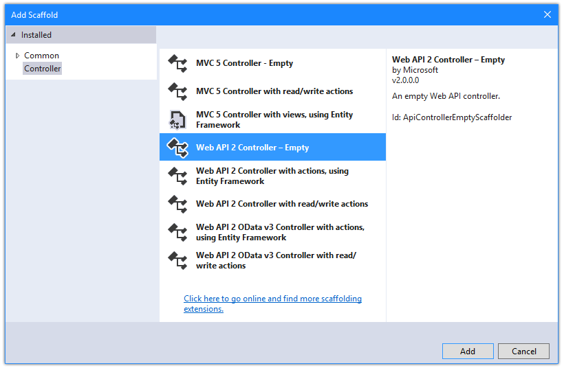
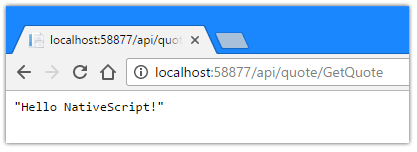
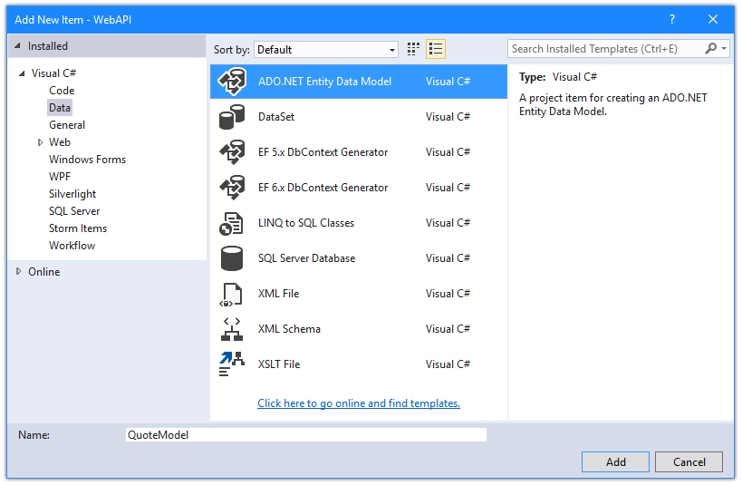
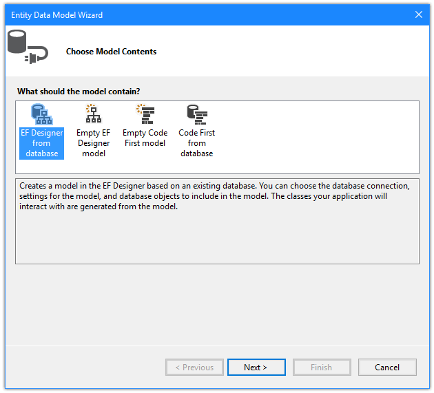
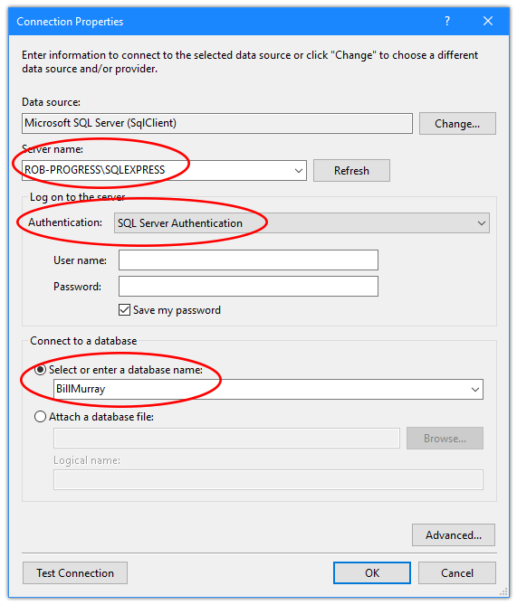
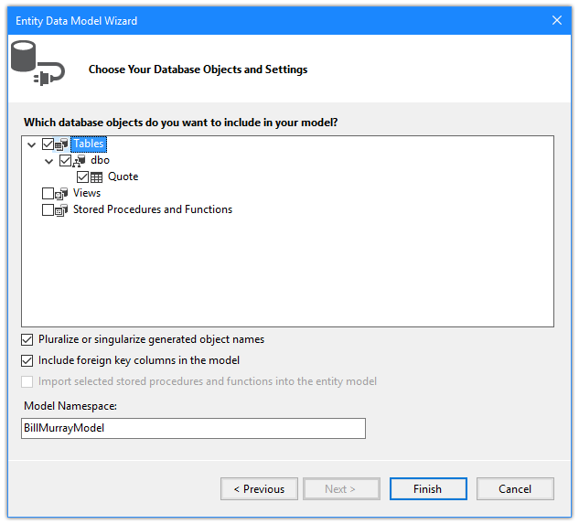
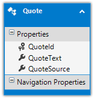
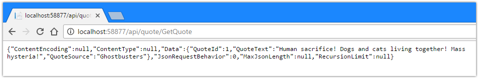

# Creating Your First Native Mobile App with Visual Studio Part 3

[**<-- Read Part 2**](#)

In this series, we are working on creating a NativeScript app with Visual Studio and SQL Server, from start to finish, using Telerik AppBuilder. In the previous post, we finished scaffolding out our app by using NativeScript layouts and added some mock data to see how it all worked. Now we need to focus on our SQL Server backend!

By the end of this article we hope to:

- Set up a new SQL Server database;
- Learn about ASP.NET Web API;
- Query our database and return a random quote.

Let's get started!

## Setting Up a SQL Server Database

As a .NET developer, you're probably more than familiar with SQL Server. For this exercise, we are going to use the free SQL Server Express edition along with SQL Server Management Studio. While setting up an instance of SQL Server is outside the scope of this tutorial, you can download and install both of these tools yourself:

- [Download SQL Server Express](https://www.microsoft.com/en-us/sql-server/sql-server-editions-express)
- [Download SQL Server Management Studio](https://docs.microsoft.com/en-us/sql/ssms/download-sql-server-management-studio-ssms)

We are going to create a very simple database with one whole table that is going to store all of our Bill Murray quotes. Your table will have three columns:

- **QuoteId** (the primary key)
- **QuoteText** (the actual quote)
- **QuoteSource** (the movie source)

Using SQL Server Management Studio, you can create this table, and it should look like this when you are done:

I'm then going to manually populate this table with a handful of quotes from some of Bill's most popular movies.

> Note: You can also download and attach this database if you don't want to go through the process of setting it up yourself.

## Why ASP.NET Web API?

Many of you also know the sordid history of web services on the .NET stack. From [SOAP](https://en.wikipedia.org/wiki/SOAP)-based services to [WCF](https://en.wikipedia.org/wiki/Windows_Communication_Foundation) to now [Web API](https://www.asp.net/web-api), .NET developers have numerous methods for exposing data via web services.

For this tutorial, we are going to stick with a Web API project. Why? It's arguably the easiest way to put together a RESTful service that leverages the commonly-used [JSON](http://www.json.org/) format.

As an example, if we were to create a SOAP-based service for this database, the response from our service might look something like this:

	<?xml version="1.0"?>
	<SOAP-ENV:Envelope xmlns:SOAP-ENV="http://www.w3.org/2001/12/soap-envelope" SOAP-ENV:encodingStyle="http://www.w3.org/2001/12/soap-encoding" >
	   <SOAP-ENV:Body xmlns:m="http://www.myservice.com/billmurray">
	      <m:GetQuoteResponse>
			<m:QuoteId>1</m:QuoteId>
	     	<m:QuoteText>Back off man, I’m a scientist.</m:QuoteText>
			<m:QuoteSource>Ghostbusters</m:QuoteSource>
	      </m:GetQuoteResponse>
	   </SOAP-ENV:Body>
	</SOAP-ENV:Envelope>

Now if you are a computer, this is perfectly legible. However, JSON has the advantage of making your service both computer- AND human-readable:

	{
		"quote": {
			"QuoteId": 1,
			"QuoteText": "Back off man, I’m a scientist.",
			"QuoteSource": "Ghostbusters"
		}
	}

## Creating an ASP.NET Web API Project

Right-click on your solution and select **New Project** to add a new web project. I'm going to choose to add a new "ASP.NET Web Application (.NET Framework)" to my solution. Those of you who are more adventurous may choose to create a [.NET Core](http://www.telerik.com/blogs/announcing-a-week-of-aspnet-core) version of this, but I'm going to play it safe.

As I set up my project, I'm only going to include the Web API template, since this project will have no user interface at all:

Now you'll notice the Web API template provides A LOT of boilerplate code. You can delete whatever you want, but we are going to keep this simple and just add a few files where we need them.

Open up your `Global.asax.cs` file and add the following two lines of code to the `Application_Start` method:

	RouteTable.Routes.MapHttpRoute("ActionApi", "api/{controller}/{action}/{id}", new { id = RouteParameter.Optional });
	GlobalConfiguration.Configuration.Formatters.XmlFormatter.SupportedMediaTypes.Clear();

The first line maps an HTTP route to a controller we will be creating. This will let an action like "http://mywebsite.com/api/Quote/GetQuote" return data from the `GetQuote` action in the `Quote` controller.

The second line forces our Web API to disable the XML formatter and return valid JSON.

## Creating an ASP.NET Web API Controller

We will need to create a [controller](https://msdn.microsoft.com/en-us/library/dd410269(v=vs.98).aspx) to process the incoming request to get a random quote from our database. Controllers process incoming requests, handle user input and interactions, and execute appropriate application logic.

Right-click the `Controllers` directory and choose to add a new controller, using the **Web API 2 Controller - Empty** template.

Name your controller **QuoteController** and open up the newly created `QuoteController.cs` file. As this is an empty template, let's add a "Hello World" function, just to make sure our Web API is returning data correctly. Go ahead and paste this into your `QuoteController.cs` file, after the opening `public class QuoteController : ApiController` line:

	[ActionName("GetQuote")]
	public string GetQuote()
	{
	    return "Hello NativeScript!";
	}

Now hit the magic Visual Studio green button to build and run this app! Your browser should open up and load the default page of your app. Simply append "/`/api/quote/GetQuote` to the URL and voila!

Now this just returns a string, so it's not too fancy. What we want to do is query our newly-created SQL Server database and return a random quote, but return the result in JSON format.

Before we get into the code of how to do this, we need to set up our data source in Visual Studio!

## Add an ADO.NET Entity Data Model

In order to access our database, we'll want to create a new ADO.NET entity data model, which is a key component of Microsoft's [Entity Framework](https://msdn.microsoft.com/en-us/library/aa937723(v=vs.113).aspx) (EF) technology. Instead of writing raw SQL, we are going to use EF to query our database.

Let's start by right-clicking on our Web API solution, adding a new **ADO.NET Entity Data Model**, and calling it `QuoteModel`:

In the next step, be sure to choose **EF Designer from database**. This is because we are going to leverage a pre-existing database to create our data model. Entity Framework also allows for "code-first" models (i.e. create a database based on your C# classes).

In the next window you'll want to select your data source. In our case we already created a table in a SQL Server instance, so go ahead and add a new data source, choosing **Microsoft SQL Server**:

In the subsequent connection properties window, be sure to specify the **server name**, **authentication type** (with credentials), and **choose the database** you are connecting:

*It can't hurt to use the **Test Connection** button, just to make sure your connection is valid!*

Finally we just have to choose the database objects that we want to use for our model. In our case, we only have one object! Go ahead and select the **Quote** table.

Assuming everything worked correctly, you should now see the `QuoteModel.edmx` diagram open in Visual Studio, with one cute little entity:

## Finish the ASP.NET Web API Controller

Phew! With that leg work out of the way, we can get back to code!

Open up the `QuoteController.cs` file (this is where we previously created the method that returned "Hello NativeScript!"). Get rid of that method and replace everything with this:

	using System;
	using System.Linq;
	using System.Web.Http;
	
	namespace WebAPI.Controllers
	{
	    public class QuoteController : ApiController
	    {
	        [ActionName("GetQuote")]
	        public System.Web.Mvc.JsonResult GetQuote()
	        {
	            BillMurrayEntities db = new BillMurrayEntities();
	
	            Random rand = new Random();
	            int toSkip = rand.Next(0, db.Quotes.Count());
	
	            Quote q = db.Quotes.OrderBy(r => Guid.NewGuid()).Skip(toSkip).Take(1).First();
	
	            return new System.Web.Mvc.JsonResult() { Data = q, JsonRequestBehavior = System.Web.Mvc.JsonRequestBehavior.AllowGet };
	        }
	    }
	}

What changed? Well, quite a bit, but the code is still relatively easy to follow:

- Instead of returning a `string` our `GetQuote` methond now returns a `JsonResult`;
- We create a random number based on the count of records in our `Quotes` table;
- We query the table, taking only the first record returned after skipping a random number of rows;
- We return the record, properly JSON-formatted!

Hit the magic green button in Visual Studio again to build and run your project. When you access `/api/quote/GetQuote` you should now see a random quote appear!

The information we want is in the `Data` property of this object. What's with all of the other properties and `null` that we see? That's because we used `JsonResult` as the return type of our method. You can also use the `Json` function, but it requires a bit of a refactoring of this code. **There are a few different ways to do this, especially if you don't always know that you want to return JSON.**

## Deploy the Web API Project

The final step of setting up your backend will be to deploy it to a location that your mobile app can access. This could be a local deployment (with an network-accessible endpoint), a remote server, or a cloud provider like Microsoft Azure.

## What's Next?

Our NativeScript app is scaffolded out. Our backend is 100% complete. Next we need to wire the two up to create a fully functional app! In the next part of this series we will do just that, plus we will take our first look at [Telerik UI for NativeScript](http://www.telerik.com/nativescript-ui) and get into animations plus styling our app with CSS.