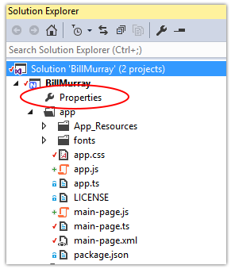
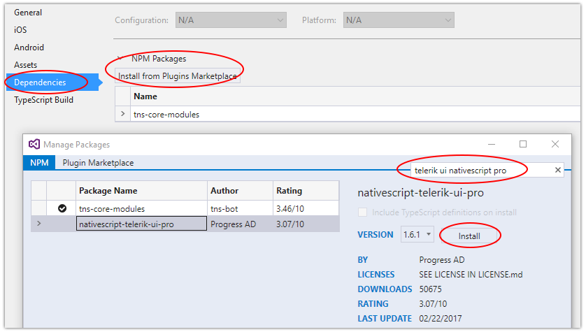
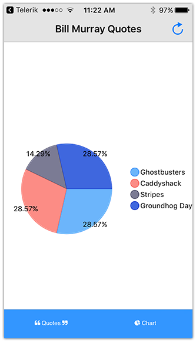

# Creating Your First Native Mobile App with Visual Studio Part 4

[**<-- Read Part 3**](#)

Over the past few blog posts, we have been working on creating a NativeScript app with Visual Studio and SQL Server - covering each and every part of the development process. We've been using the capabilities of Telerik AppBuilder to allow us to develop an iOS app from within Windows (all without having a Mac).

In the previous post, we knocked out our SQL Server/ASP.NET Web API backend. Now we are going to wire up our app and make it look gorgeous. By the end of this article we hope to:

- Wire up our NativeScript app with our backend service;
- Learn about NativeScript animations and style our app with CSS;
- Implement a chart with Telerik UI for NativeScript.

Let's get started!

## NativeScript + ASP.NET Web API

In the last post we created a very simple Web API service. Let's take a moment to wire that service up to our app!

We are going to kill two birds with one stone by creating a new method that will handle both the initial load of a quote from our Web API, but also to handle what happens when we want to load a *new* quote.

In our `main-page.xml` file, change the `tap` method for our `ActionItem` to a new JavaScript function called `loadQuote`:

	<ActionItem tap="loadQuote" ...

Next, in our `main-page.ts` file, we are going to change a few things around to accommodate a new `loadQuote` method. We need the `loadQuote` method to fetch data from our remote endpoint, format the JSON response, and bind it to our UI elements.

Here is the complete `main-page.ts`:

	import observable = require("data/observable");
	import pages = require("ui/page");
	
	let page;
	
	export function pageLoaded(args: observable.EventData) {
	    page = <pages.Page>args.object;
	    loadQuote();
	}
	
	function getRandomNumber(min: number, max: number) {
	    return Math.random() * (max - min) + min;
	}
	
	export function loadQuote() {
	    let myLayout = page.getViewById("layout");
	
	    fetch("http://your-web-server.com/billmurray/api/quote/GetQuote").then(response => { return response.json(); }).then(function (r) {
	        myLayout.bindingContext = {
	            quote: "\"" + r.Data.QuoteText + "\" - " + r.Data.QuoteSource,
	            image: "https://www.fillmurray.com/200/" + getRandomNumber(295, 305)
	        };
	    });
	}

**What all changed?**

- The value of the `page` variable is still set on `pageLoaded`, but now available to other methods;
- We added a simple `getRandomNumber` function to return a random number between two values (why? see below!);
- We added a `loadQuote` function that uses the fetch API to access our remote Web API.

> You may notice `r.Data` prepended to the `QuoteText` and `QuoteSource` properties from the JSON response. If you recall in part 3, the data we want from our Web API is contained in the `Data` property.

*So what's with the random number?* We append a random number to our request from fillmurray.com. This is a quick-and-dirty way to get a random image with every request (since each request with a different pixel size provides a different image).

Once these changes are in place, use the **Synchronize {app name} with Cloud** menu option and do a **three-finger press** to load your changes (or use the **Build {app name} in Cloud** to load a new copy of the app). The app should work like it used to, but also provide the ability to load a new quote.

But we can do better!

## Animations and Styling

NativeScript's power comes from the ability to use JavaScript/TypeScript to create truly native mobile apps. But I contend that any great app needs to be easy to style and have engaging features that keep the end user coming back for more. And NativeScript also enables you to create these more engaging user experiences by:

1. Providing an easy to understand [animation API](https://docs.nativescript.org/ui/animation);
2. Letting you re-use your web-based [CSS styling](https://docs.nativescript.org/ui/styling) knowledge.

### Quick Look at Animations

**Let's start by adding some animations to our app.** I'd like to animate the `Label` element when a quote is loaded and when it is replaced with a new quote.

Back in the `main-page.xml` file, we need to give our `Label` element an id, so it can be easily selected and animated in our code-behind:

	<Label text="{{ quote }}" class="title" textWrap="true" id="lblQuote" />

At the top of `main-page.ts`, we need to import the `AnimationCurve` enumeration like so:

	import {AnimationCurve} from "ui/enums";

All of the other changes happen in the `loadQuote` method. Let's look at the new method and then go through the changes we made:

	export function loadQuote() {
	
	    let myLayout = page.getViewById("layout");
	    let lblQuote = page.getViewById("lblQuote");
	
	    lblQuote.animate({
	        translate: { x: -300, y: 0 },
	        duration: 250,
	        curve: AnimationCurve.linear
	    }).then(() => {
	
	        fetch("http://your-web-server.com/billmurray/api/quote/GetQuote").then(response => { return response.json(); }).then(function (r) {
	
	            myLayout.bindingContext = {
	                quote: "\"" + r.Data.QuoteText + "\" - " + r.Data.QuoteSource,
	                image: "https://www.fillmurray.com/200/" + getRandomNumber(295, 305)
	            };
	
	            lblQuote.animate({
	                translate: { x: 0, y: 0 },
	                duration: 1000,
	                curve: AnimationCurve.spring
	            });
	
	        });
	    });
	}

**What all changed?**

- We get a reference to our `lblQuote` element;
- We `animate` the quote out of view (negative x-axis) using a [linear animation](https://docs.nativescript.org/ui/animation#animation-curves);
- Since `animate()` method returns an [ES6 promise](https://developer.mozilla.org/en-US/docs/Web/JavaScript/Reference/Global_Objects/Promise), it's easy to chain operations together with `.then` syntax;
- We fetch the data and again animate the label back into view with a [spring animation](https://docs.nativescript.org/ui/animation#animation-curves);

### Quick Look at Styling with CSS

Before we see the result of our labors, let's put the final styling touches on our app with some CSS.

There are a few UI tweaks I'd like to make to this app. Namely:

- The font size could be smaller;
- Bill Murray's image needs a little margin to add white space;
- The action bar and tab strip could use some color;
- Add some font icons to our tab strip.

**Let's take a look at how we can do all of this with some simple CSS!**

First up, font size. You'll see how our `Label` element already has `class="title"`. Yes, this is in fact the same class selector you use on the web! Go ahead and open up the `app.css` file.

> Remember that styles added to `app.css` are available globally. If you want page-specific classes, use the `page-name.css` syntax.

Find the `.title` selector and decrease the `font-size` property from 36 to 24. Remember we use device-agnostic units in NativeScript, so don't add a "px" or "em" to your sizes.

Next, let's add some margin to our image. You can probably figure this out on your own, but we are simply going to add a `class` to our existing `Image` element, like so:

	<Image src="{{ image }}" class="image" />

...and in our CSS file, add:

	.image {
		margin: 20;
	}

Now let's add some color! Following a similar pattern, we are going to add classes to our `ActionBar` and `TabView` elements in `main-page.xml`:

	<ActionBar title="Bill Murray Quotes" class="action-bar">

and

	<TabView class="tab-view">

...and in our CSS file, add:

	.action-bar {
	    background-color: #e0e0e0;
	}
	
	.tab-view {
	    tab-background-color: #1084ff;
	    tab-text-color: #ffffff;
	    selected-tab-text-color: #ffffff;
	}

**Last, but not least, let's add a new font to our app to display icons.** NativeScript allows you to use TTF fonts in your app, just like you would on the web.

Start by downloading the latest [Font Awesome font set](http://fontawesome.io/). Unzip it and find the `fontawesome-webfont.ttf` file (in my case found at "font-awesome-4.7.0\fonts"). Create a new directory called **fonts** inside your **app** directory in your Visual Studio project. Copy and paste the `fontawesome-webfont.ttf` file into that directory.

Our `.tab-view` CSS can now have the `FontAwesome` font applied to it, like so:

	.tab-view {
	    ...
	    font-family: FontAwesome;
	}

Now we can use the Font Awesome icon set! Let's add icons to our "Quotes" and "Chart" tabs. Open up `main-page.xml` and replace the two `TabViewItem` titles with these:

	<TabViewItem title="&#xf10d; Quotes &#xf10e;">

and

	<TabViewItem title="&#xf200; Chart">

## Telerik UI for NativeScript Charts

If you're looking to add some pizazz to your apps (who isn't?), you need look no further than [UI for NativeScript](http://www.telerik.com/nativescript-ui). UI for NativeScript provides a set of fully native, cross-platform, components to extend your app with gorgeous and functional UI.

While we are going to limit our usage of UI for NativeScript to the [Chart component](https://www.nativescript.org/blog/a-deep-dive-into-telerik-ui-for-nativescript-s-charts), we've written extensively in the past about many of the other components, such as:

- [ListView](https://www.nativescript.org/blog/a-deep-dive-into-telerik-ui-for-nativescripts-listview)
- [SideDrawer](https://www.nativescript.org/blog/a-deep-dive-into-telerik-ui-for-nativescripts-sidedrawer)
- [DataForm](https://www.nativescript.org/blog/a-deep-dive-into-telerik-ui-for-nativescripts-dataform)
- [AutoCompleteTextView](https://www.nativescript.org/blog/a-deep-dive-into-telerik-ui-for-nativescripts-autocompletetextview)
- [Calendar](https://www.nativescript.org/blog/a-deep-dive-into-telerik-ui-for-nativescripts-calendar)

UI for NativeScript comes in two flavors: a series of free controls (ListView and SideDrawer) and a series of paid controls (all the rest). The Chart component is one of the paid controls, so we are continue this tutorial by using a [free trial of UI for NativeScript Pro](http://www.telerik.com/download-trial-file/v2/nativescript-ui)!

We can install UI for NativeScript via the **Properties** window:

With the properties window open:

1. Choose the **Dependencies** pane;
2. Click the **Install from Plugins Marketplace** button;
3. Click the **npm** tab in the **Manage Packages** window;
4. Search for "telerik ui nativescript pro";
5. Click **Install**.

> Since we are using the Telerik Platform Companion App to use/debug our app, we don't need to go through this installation process as UI for NativeScript is set up by default. However, if we were to build and deploy it as a standalone app, we will need it installed.

Open up `main-page.xml` and add the namespace for our chart component to our top-level `<Page>` element like so:

	<Page xmlns="http://schemas.nativescript.org/tns.xsd" xmlns:chart="nativescript-telerik-ui-pro/chart" loaded="pageLoaded">

Next, replace the `<Label>` that we used as a placeholder for our chart with this block of code:

	<chart:RadPieChart height="300">
		<chart:RadPieChart.series>
			<chart:PieSeries
				selectionMode="None"
				items="{{ movies }}"
				outerRadiusFactor="0.8"
				valueProperty="count"
				legendLabel="movie"
				showLabels="true">
			</chart:PieSeries>
		</chart:RadPieChart.series>
		<chart:RadPieChart.legend>
			<chart:RadLegendView
			position="Right"
			width="110" />
		</chart:RadPieChart.legend>
	</chart:RadPieChart>

The specifics of each `RadPieChart` property can be [learned here](http://docs.telerik.com/devtools/nativescript-ui/Controls/NativeScript/Chart/Series/pie). Most should be self-explanatory, but I encourage you to try out different values to see how you can customize your chart control.

Finally, open up `main-page.ts` and add a new function to your `pageLoaded` function:

	export function pageLoaded(args: observable.EventData) {
	    page = <pages.Page>args.object;
	    loadQuote();
	    loadChart();
	}

And the corresponding `loadChart()` function should look like this:

	function loadChart() {
	    let chartData = new observable.Observable();
	    chartData.set("movies", [
	        { movie: "Ghostbusters", count: 2 },
	        { movie: "Caddyshack", count: 2 },
	        { movie: "Stripes", count: 1 },
	        { movie: "Groundhog Day", count: 2 }
	    ]);
	    page.bindingContext = chartData;
	}

What's that? We are cheating? Yes, in this case to save time we are mocking in some data, but in reality you would want to create another simple Web API service that exposes the counts of movie quotes with their associated movies.

You'll also notice that we are setting a `bindingContext` on the page itself, not just on an individual control. NativeScript provides ample flexibility in code-writing styles!

Make sure you save your changes, use the **Synchronize {app name} with Cloud** menu option and do a **three-finger press** to load your changes:

> Tip: When managing custom NativeScript plugins within Visual Studio, it's a good idea to [consult these instructions](http://docs.telerik.com/platform/appbuilder/nativescript/working-with-custom-modules/manage-npm-custom-modules).

## Animations + CSS + Icon Font + Chart =

With everthing saved, use the **Synchronize {app name} with Cloud** menu option and do a **three-finger press** to load your changes (or use the **Build {app name} in Cloud** to load a new copy of the app if it's been a while since you last synced).

 

## Are We Done?

Yes! Congratulations! If you've made it this far you have (hopefully) built a complete NativeScript app from beginning to end with Visual Studio. Your app should work equally well on iOS and Android, all *without making any code changes to support completely different platforms!* You used Microsoft technologies like TypeScript, SQL Server, and Web API to build a complete app, front end and back end.

And while we went uber-simple with our code, you can utilize the [built-in MVVM support](https://docs.nativescript.org/tutorial/chapter-3) of NativeScript to better structure your app.

## Next Steps

This is just the proverbial beginning! There is A LOT more you can do with AppBuilder and Visual Studio to boost your development productivity. You can use Visual Studio and AppBuilder to:

1. Debug your NativeScript app.
2. Build and deploy a true version of the app to an iOS or Android device.
3. Deploy your app to the app stores.

This is all from Windows, all using Visual Studio and the features provided by AppBuilder. If you haven't already, start your free trial of AppBuilder and happy NativeScripting!