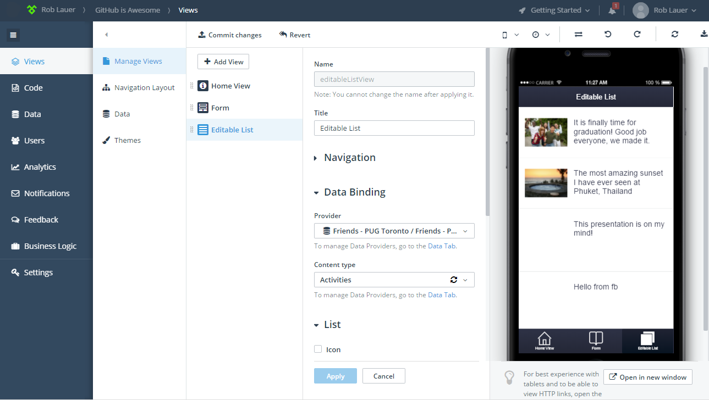
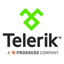

## Telerik Platform

### Contacts

- A technical support contact: Tina Stancheva (Tina.Stancheva@telerik.com)
- A security contact: Ivalyo Bratoev (Ivaylo.Bratoev@telerik.com)
- An escalation contact: platform-security@progress.com (a wider email distribution list for critical issues)

### Links

- Documentation: http://docs.telerik.com/platform/
- Terms of service: http://www.telerik.com/purchase/license-agreement/telerik-platform
- Privacy Policy: http://www.telerik.com/company/privacy-policy
- Support: http://www.telerik.com/account/support-tickets/my-support-tickets.aspx
- Status: http://status.telerik.com/
- Pricing: https://www.telerik.com/purchase/platform
- Installation: https://platform.telerik.com

### Categories

Build and deploy

### Type of listing

"Learn more" listing (for now...)

### One line blurb

Build cross-platform native mobile apps with JavaScript.

### Description

Telerik Platform is comprised of a set of tools and services that enable you to create cross-platform mobile apps using JavaScript. The services provided address the entire app development lifecycle: from coding, testing, debugging, managing data, measuring app performance, gathering feedback, to distribution. The Telerik Platform relies on Apache Cordova for building hybrid mobile apps and NativeScript for developing truly native mobile apps using JavaScript. We even provide offline tooling in the form of a full-featured CLI and a Visual Studio extension.

### Images

### Features

#### Easy GitHub integration

With just a few clicks you can link your Telerik Platform mobile app to a GitHub repository. Once the connection is established, you can issue a variety of git commands using our cloud-based clients. Alternatively you can roll your own GitHub integration by leveraging our Visual Studio extension and/or our CLI.

#### Create mobile apps with JavaScript

Whether you want to create cross-platform hybrid apps using Apache Cordova, or truly native apps using the NativeScript framework, Telerik Platform provides full support. You aren't limited to any specific framework either - whether it's Kendo UI or Ionic, you are free to choose with the Telerik Platform.

#### Connect mobile apps to existing data

By leveraging Telerik Backend Services and our Data Connectors, you can easily connect your existing data to your mobile app. Likewise, Telerik Backend Services provides easy to configure push notifications, responsive images, and comprehensive user management.

#### See your app as it's being built

Apps built with the Telerik Platform can be viewed in our mobile app simulator, a local emulator, or on any connected devices. Using a feature we call LiveSync, changes that you make are instantly available on your device - no reloading necessary.

#### Build and deploy apps via the cloud

We handle all of the build tooling and SDK management for you. With iOS, Android, and Windows Phone build servers, you can create cross-platform builds with the click of a button. You don't even need a Mac to create an iOS app.

### Logo

