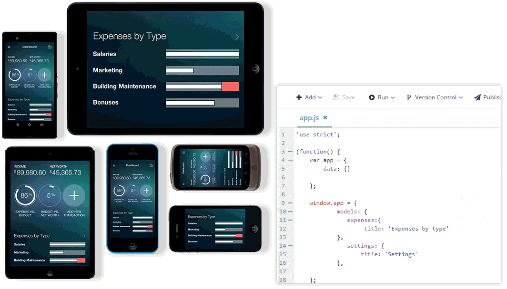

## Programmatic Access to LiveSync in Telerik Platform

LiveSync is a feature of [Telerik AppBuilder](http://www.telerik.com/platform/appbuilder) (part of [Telerik Platform by Progress](http://www.telerik.com/platform)) that allows you to instantly experience changes to your code on devices and simulators. We were among the first to bring this type of functionality to the masses, yet most people don't know about the programmatic API that exists to directly interact with LiveSync!

### LiveSync and Telerik AppBuilder

Usually you don't think twice about how you use LiveSync, right? It's enabled by default for all debugging situations and you can leverage it in a variety of ways:

- With our best-of-breed mobile device simulators
- Via our [Companion Apps for iOS, Android, and Windows Phone](http://www.telerik.com/platform/appbuilder/companion-app)
- On any connected mobile device

**LiveSync instantly updates all of the code in your app (HTML/XML, JavaScript, and CSS) without you having to re-build and re-deploy the app!**

LiveSync is cross-platform (works on iOS, Android, and Windows Phone). And while we've had LiveSync enabled for Apache Cordova hybrid mobile apps for ages, we also recently introduced LiveSync for [NativeScript](https://www.nativescript.org/) apps [as well](http://docs.telerik.com/platform/appbuilder/nativescript/running-your-app/livesync-app)!

A little known fact is **LiveSync has a JavaScript API** - what does that mean and how can it help you? Read on:

### Enabling and Disabling LiveSync

> Note that while LiveSync works with NativeScript, the public JavaScript API does not exist yet.

Why would someone want to *disable* LiveSync? When you are using LiveSync with our Companion Apps, you initiate a LiveSync action via a three-finger press. What if your device uses a three-finger press for something else? Hello conflict! Luckily there is a `window.livesync` object for you to interact with. For instance:

To disable LiveSync on an app use `livesync.disable()`. Likewise, to enable LiveSync you use `livesync.enable()`. Easy enough!

Now that's convenient to have, but the cool part of the LiveSync API is initiating a LiveSync via code:

### Initiating a LiveSync

Even if the three-finger gesture is disabled, you can still initiate a LiveSync in code. In fact, you can initiate a LiveSync whenever and wherever you want!

To do so, simply use the `livesync.sync()` method. When this code is executed, your app fetches all of the latest changes from the cloud (be they HTML, JavaScript, or CSS) and updates your app in no time.

This means you can truly execute the `livesync.sync()` method whenever you like. Do you want to add an "update" button to your app that more clearly initiates a LiveSync for your testers? Go ahead! Do you want to initiate a LiveSync update when a user performs a certain action? Knock yourself out.

> If you are using an offline Telerik AppBuilder client like our [extension for Visual Studio](http://www.telerik.com/platform/appbuilder/visual-studio-extension), you need to make sure your apps are connected to the cloud for LiveSync to work correctly.

### When Can I Use LiveSync?

Just to be clear, LiveSync is only available while debugging your app. This means you have to be using our simulators, [Companion Apps](http://www.telerik.com/platform/appbuilder/companion-app), or have deployed a build of an app in debug mode. If you create an app store-ready build, LiveSync is disabled. **But, what if you DO want to use LiveSync-like functionality to "hot patch" your app in production?**

### LiveSync in Production?

Yes, we have an answer for that! By leveraging a similar feature called AppManager LiveSync, you can dynamically update apps that have already been published via the app stores! [Click here to learn more about AppManager LiveSync](http://docs.telerik.com/platform/appbuilder/cordova/appmanager-livesync/overview).

> AppManager LiveSync is available for hybrid apps today and NativeScript apps very soon!

**Happy LiveSyncing!**