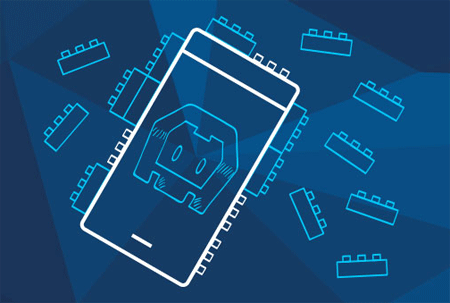

## Verified Plugins Marketplace: Your Source for Verified Cordova/PhoneGap Plugins

With custom plugins, hybrid mobile developers are able to extend the functionality of their mobile apps to reach more native device functionality than is normally possible with the Cordova/PhoneGap framework. Today, we have integrations with social sharing features, push notifications, Bluetooth, Facebook, ad networks, and on and on - all through custom Cordova plugins. The problem, though, is that the custom plugin space is still the "wild west" - there is no definitive source of where to go for functional, verified, and documented plugins for hybrid development. Until today that is, as I'm pleased to announce the availability of the [Verified Plugins Marketplace](http://plugins.telerik.com/)!

### The Current State of Custom Plugins

Do a search for any popular Cordova plugin and odds are you will find at least 2-3 different GitHub repositories that claim to perform the same function. As a hybrid developer, how do you know for sure which repository to use? Do you pick the one with the most GitHub stars? The most recent updates? The best documentation and code samples? At Telerik we aim to take away this confusion by doing the heavy lifting for you and providing one definitive source for some of the most popular custom Cordova plugins out there.

What specifically does this mean? Here at Telerik we work on resolving existing issues with the plugin code, fully documenting the functionality with easy to follow code samples, and in some cases even extending the plugin to new platforms - fulfilling the promise of true cross-platform development. Each plugin also comes with a fully functional sample app built with the free and open source [Kendo UI](http://www.telerik.com/kendo-ui) JavaScript framework.

### So How Do I Use the Plugins Marketplace?

Available at [plugins.telerik.com](http://plugins.telerik.com/), the Verified Plugins Marketplace is a freely accessible web site, open to the world. There is no fee to access the plugins. You don't need to create an account to browse, search, filter, and download the plugins you want to try. When you view the details of a plugin, we offer you a few convenient ways to try and use the plugin:

### Try Plugin in AppBuilder

When you click on the **Try Plugin in AppBuilder** button, you will be sent to the [Telerik AppBuilder](http://www.telerik.com/appbuilder) in-browser client. *(Be sure to sign up for your [free Telerik AppBuilder trial](https://platform.telerik.com) if you haven't yet!).*

Once logged in, you will be able to instantly clone the Kendo UI sample app we have created for the selected plugin in AppBuilder. From there you can run the sample app on a mobile device to see how the plugin functions. **It's that simple.**

### Download Plugin

By clicking on the **Download Plugin** button, you will download the zip archive of the plugin source. Where you go from there is up to you! If you want to use the plugin with the [AppBuilder in-browser client](http://www.telerik.com/appbuilder/in-browser-client), [AppBuilder Windows client](http://www.telerik.com/appbuilder/windows-client), or the [AppBuilder extension for Visual Studio](http://www.telerik.com/appbuilder/visual-studio-extension), we provide you with simple, easy to follow instructions.

### Cordova and AppBuilder Command Line Interfaces

Finally, if you are a [Cordova CLI](https://cordova.apache.org/docs/en/3.5.0/guide_cli_index.md.html) or [AppBuilder CLI](http://www.telerik.com/appbuilder/command-line-interface) user, we provide you with the appropriate commands to install the plugin from our GitHub repository. Just copy and paste the command and you are good to go.

### Plugin Support and Maintenance

We at Telerik have taken it upon ourselves to do our best to actively maintain all of the plugins that are part of the Verified Plugins Marketplace. If you have any support requests and would like to submit an issue, we provide a link to the appropriate GitHub issues page for each plugin. When new versions of mobile operating systems are released and updates to Cordova are published, we will make sure our plugins continue to function as advertised.

### Suggest a Plugin

The Verified Plugins Marketplace is brand new - so new that we have only just started publishing a small chunk of our planned plugins. While we have a good plan in place for publishing additional plugins, the future of the marketplace is really up to you. Is there a custom Cordova plugin that you would like to see included in the marketplace? If so, you should [let us know](https://telerik-verified-plugins.uservoice.com/)!

### What's Next?

Your next step is your first step - take a look at the [Verified Plugins Marketplace](http://plugins.telerik.com/) and let us know what you think. Your feedback is crucial to the success of the marketplace. As time goes on we will be working to expand our list of supported plugins and truly help to empower hybrid mobile developers to create the best apps possible.
